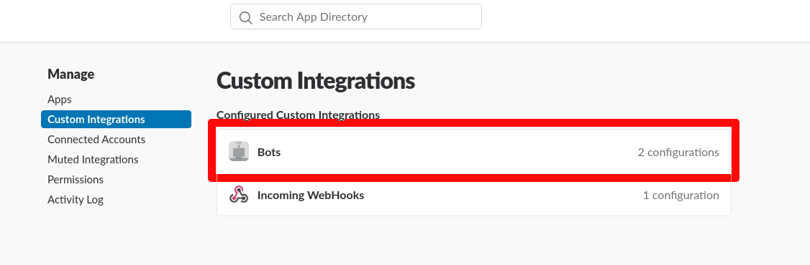

<h1>Howl Slack</h1>

<br /><br />
<br /><br />
<br /><br />
An awesome program that reads out loud messages from slack channels.
<br /><br />
<br /><br />
<br /><br />

# What is Howl Slack ?

HowlSlack is a bot that watches a channel's messages and read out them louds.
We use it at work to make announcements through offices ! Each office has a small Raspberry PI connected to speakers which runs Howl Slack.

We connected some endpoints of our API to Slack through Zappier. For example when someone orders something we have a message sent to Slack and then Howl Slack reads it and everyone hears:

```
🔊 Foo bar just ordered <something> for <that> amount of money ! Good Job !
```

There is pretty fun use cases for this ! As you can connect a lot of things to Slack but also you can type yourself messages.

```
🔊 John, you're fired
🔊 Just kidding
```

# Setup

## Slack

Go to

```
https://YOUR_SUBDOMAIN.slack.com/apps/manage/custom-integrations
```

1) Click on bots



2) Add a configuration


3) Create a bot


4) Get your bot token


This the token you'll copy and paste in `config.json`

```json
{
  "SlackToken": "PUT YOUR TOKEN HERE"
}
```

5) Add the bot to a channel

Assuming you called your bot `howl-bot`, create a channel or add it to an existing one.


## Hardware

There is some pre-built binaries here.

At work we launch it on a Raspberry PI connected to speakers.


### AWS

Download the aws-cli for your system.
Then configure it

```shell
aws configure
```

The app use the **Polly** service from S3.

More info on pricing:

```
https://aws.amazon.com/polly/pricing/
```

But it's **cheap**.

### Run it

For Raspberry (or ARM based systems)

```shell
./builds/howl-slack_arm
```

For x64 systems

```shell
./builds/howl-slack_unix
```


# Build

Build the project:

Go version needed: `> go1.11.2`

```shell
make deps
make
```

Then just run the binary.

```shell
./howl-slack
```

The program will output the messages in real-time from the slack channel.

# Credits (icon)

<div>Icons made by <a href="https://www.freepik.com/" title="Freepik">Freepik</a> from <a href="https://www.flaticon.com/" 			    title="Flaticon">www.flaticon.com</a> is licensed by <a href="http://creativecommons.org/licenses/by/3.0/" 			    title="Creative Commons BY 3.0" target="_blank">CC 3.0 BY</a></div>


# License

`Howl Slack` is licensed under the GPLv3 License, sponsored and supported by <a href="https://hypermoon.io/" rel="noopener" target="_blank">HyperMoon</a>.
